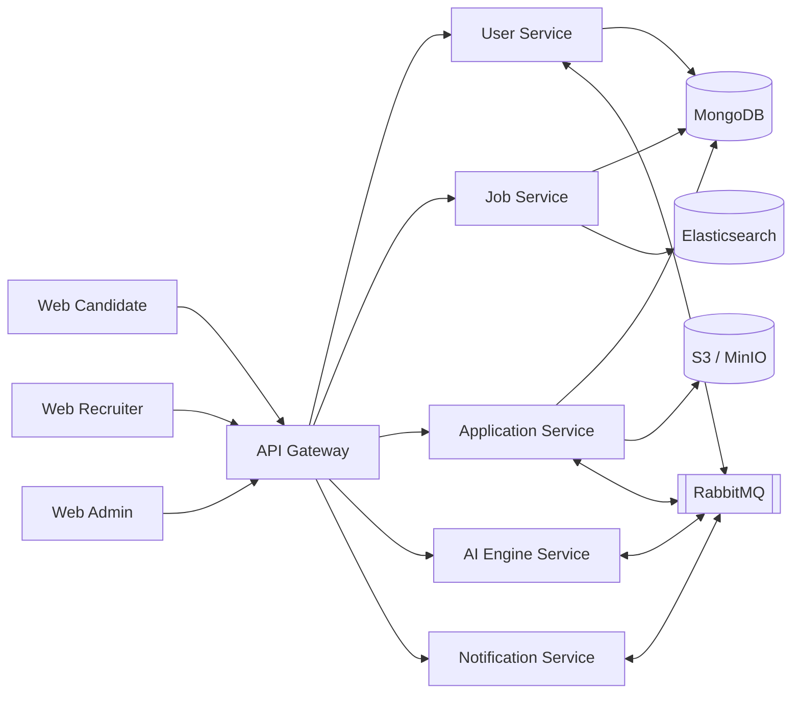

# Báo Cáo Tổng Quan Hệ Thống SmartCV

Tài liệu này mô tả SmartCV theo góc nhìn hệ thống: tổ chức microservice, luồng dữ liệu, cách gọi LLM API, cách lưu trữ CV/job/application, và cách các thành phần phối hợp với nhau để phục vụ ứng viên, nhà tuyển dụng, và quản trị viên.

## 1. Mục Tiêu Hệ Thống

SmartCV là nền tảng tuyển dụng thông minh. Hệ thống không chỉ cho phép đăng tin và ứng tuyển, mà còn có các lớp xử lý nâng cao như:

- Xác thực người dùng bằng JWT.
- Quản lý hồ sơ ứng viên và nhà tuyển dụng.
- Đăng tin, duyệt tin, tìm kiếm việc làm.
- Upload CV lên S3/MinIO và phục vụ preview.
- Phân tích CV bằng LLM/AI.
- Tự động gợi ý việc làm, tạo câu hỏi phỏng vấn, và chấm điểm phù hợp ứng viên.
- Gửi thông báo theo sự kiện qua RabbitMQ.

Điểm quan trọng của kiến trúc là tách domain theo microservice, thay vì gom toàn bộ logic vào một backend monolith.

## 2. Kiến Trúc Tổng Thể

Hệ thống được chia thành 3 lớp chính:

1. Lớp giao diện:
- `web-candidate` cho ứng viên.
- `web-recruiter` cho nhà tuyển dụng.
- `web-admin` cho quản trị viên.

2. Lớp điều phối:
- `api-gateway` nhận request đầu vào, kiểm tra JWT, áp chính sách routing, và chuyển tiếp sang service phù hợp.

3. Lớp nghiệp vụ:
- `user-service`
- `job_service`
- `application_service`
- `ai_engine_service`
- `notification-service`

Hạ tầng đi kèm:

- `MongoDB` lưu dữ liệu nghiệp vụ chính.
- `Elasticsearch` phục vụ tìm kiếm job.
- `Redis` dùng cho cache, OTP, token blacklist, hoặc dữ liệu ngắn hạn.
- `RabbitMQ` xử lý event bất đồng bộ.
- `S3/MinIO` lưu file CV, logo, banner, business license.
- `PostgreSQL` trong notification-service nếu cần lưu log/thông tin thông báo.

## 3. Tổ Chức Microservice

### 3.1 `api-gateway`

Gateway là điểm vào duy nhất của hệ thống. Nó có nhiệm vụ:

- Xác thực JWT.
- Chuyển request sang service đúng domain.
- Truyền các header nội bộ như `X-User-Id`, `X-User-Roles`.
- Giữ cho frontend không phải biết trực tiếp địa chỉ từng service.

### 3.2 `user-service`

Đây là service quản lý người dùng và hồ sơ:

- Đăng ký, đăng nhập, xác thực OTP.
- Quản lý `User`.
- Quản lý `Candidate`.
- Quản lý `Recruiter`.
- Upload CV, avatar, logo, business license.
- Trả dữ liệu profile cho các service khác qua internal API.

Trong code, các document Mongo dùng `_id` kiểu string, không dùng `ObjectId`.

### 3.3 `job_service`

Service này chịu trách nhiệm cho miền việc làm:

- CRUD job.
- Duyệt tin.
- Lọc trạng thái hiển thị.
- Search full-text qua Elasticsearch.
- Phân loại job theo ngành/nghề.
- Cung cấp job public cho candidate và job quản lý cho recruiter/admin.

### 3.4 `application_service`

Service này quản lý vòng đời ứng tuyển:

- Tạo application.
- Cập nhật trạng thái ứng tuyển.
- Gắn `cvUrl`, cover letter, aiScore, matched/missing skills.
- Kết nối job-service để kiểm tra job.
- Kết nối user-service để lấy email, tên ứng viên, và thông tin recruiter.
- Phát event cho notification và AI scoring.

### 3.5 `ai_engine_service`

Đây là service AI trung tâm. Nó nhận input từ application/candidate/job rồi gọi LLM API để:

- Phân tích CV.
- Trích xuất kỹ năng.
- Chấm điểm match giữa CV và JD.
- Sinh câu hỏi phỏng vấn.
- Cải thiện CV.
- Gợi ý việc làm phù hợp.

Điểm đáng chú ý là AI service không bị khóa vào một nhà cung cấp duy nhất. Trong code hiện có nhiều model gateway, ví dụ:

- Claude/Anthropic.
- Gemini.
- Groq/Llama.
- Azure OpenAI.

### 3.6 `notification-service`

Service Go này xử lý thông báo bất đồng bộ:

- Gửi OTP.
- Gửi thông báo ứng tuyển.
- Gửi thông báo đổi trạng thái.
- Có thể mở rộng cho email, push, hoặc websocket notification.

## 4. Luồng Hoạt Động Chính

### 4.1 Đăng ký và đăng nhập

Luồng đăng ký thường đi qua:

1. Người dùng gửi request từ frontend.
2. Gateway kiểm tra route công khai.
3. `user-service` tạo user mới với trạng thái chưa xác thực.
4. OTP được tạo và lưu tạm ở `Redis`.
5. Event được đẩy sang `RabbitMQ`.
6. `notification-service` gửi OTP qua email hoặc kênh phù hợp.
7. Người dùng xác thực OTP.
8. `user-service` kích hoạt tài khoản và phát JWT.

Kết quả là toàn bộ hệ thống sau đó dùng JWT để phân quyền.

### 4.2 Upload CV và phục vụ preview

Luồng CV gồm hai mục tiêu khác nhau: lưu trữ file và phục vụ preview.

1. Ứng viên upload CV từ `web-candidate`.
2. Request đi qua gateway tới `user-service`.
3. `user-service` upload file lên S3/MinIO.
4. `user-service` lưu metadata CV vào MongoDB.
5. Một số luồng AI có thể lấy file từ `s3Key` để phân tích sau.
6. Khi người dùng mở lại CV, hệ thống nên tạo URL mới nếu URL trước đó là presigned URL đã hết hạn.

Điểm thiết kế quan trọng:

- Không nên coi URL presigned là dữ liệu vĩnh viễn.
- Nên lưu `s3Key` để có thể refresh URL bất cứ lúc nào.
- Preview CV ở recruiter nên đọc URL mới, không nên phụ thuộc vào link cũ đã hết hạn.

### 4.3 Đăng tin và duyệt tin tuyển dụng

Luồng recruiter:

1. Recruiter tạo hoặc cập nhật profile công ty.
2. Recruiter tạo job mới.
3. Job được lưu ở MongoDB với trạng thái phù hợp.
4. Admin duyệt job hoặc từ chối job.
5. Job đã publish sẽ được index sang Elasticsearch để search nhanh.

Điểm hợp lý của cách tách này:

- Dữ liệu job là giao dịch nghiệp vụ.
- Chỉ những job public mới cần tối ưu tìm kiếm toàn văn.
- Elasticsearch không thay thế MongoDB, mà bổ trợ cho search.

### 4.4 Ứng tuyển và chấm điểm AI

Luồng nộp đơn là một trong các luồng quan trọng nhất:

1. Candidate chọn job và nộp application.
2. `application_service` kiểm tra job còn hoạt động hay không.
3. `application_service` kiểm tra candidate chưa nộp trùng.
4. Application được lưu vào MongoDB.
5. Service phát event sang AI engine để chấm CV.
6. AI engine dùng CV, job title, job description, skills để tính match score.
7. Kết quả quay lại `application_service`.
8. Notification service gửi thông báo cho recruiter và/hoặc candidate.

Kết quả cuối:

- Recruiter thấy danh sách ứng viên.
- Candidate thấy trạng thái ứng tuyển.
- AI score hỗ trợ sàng lọc nhanh hơn.

## 5. Cách Sử Dụng LLM API

SmartCV dùng LLM như một lớp suy luận thay vì thay thế hoàn toàn business logic.

### 5.1 Vai trò của LLM

LLM được dùng để:

- Tóm tắt CV.
- Trích xuất kỹ năng.
- So khớp CV với JD.
- Sinh câu hỏi phỏng vấn.
- Gợi ý cải thiện CV.

### 5.2 Luồng gọi LLM

Luồng phổ biến:

1. Service nghiệp vụ gửi event hoặc request tới AI engine.
2. AI engine lấy dữ liệu cần thiết từ MongoDB hoặc S3.
3. AI engine build prompt có cấu trúc.
4. AI engine gọi provider LLM.
5. AI engine chuẩn hóa JSON output.
6. Kết quả được lưu lại cho ứng dụng hoặc candidate.

### 5.3 Vì sao tách AI ra service riêng

Tách AI ra service riêng giúp:

- Dễ thay đổi model provider mà không đụng các service nghiệp vụ.
- Dễ throttle, retry, cache prompt result.
- Dễ log cost và usage theo user/job/application.
- Tránh làm chậm API chính khi LLM phản hồi chậm.

### 5.4 Nguyên tắc thiết kế prompt

Prompt nên:

- Có schema output rõ ràng.
- Có input được chuẩn hóa từ backend.
- Không để LLM tự bịa những dữ liệu nghiệp vụ như trạng thái đơn, ID, hay mức lương.
- Trả kết quả có thể map vào model nội bộ.

## 6. Dữ Liệu Và Lưu Trữ

### 6.1 MongoDB

MongoDB là nơi lưu dữ liệu lõi:

- `users`
- `candidates`
- `recruiters`
- `jobs`
- `applications`
- `assessments`
- `attempts`

Ưu điểm:

- Linh hoạt với document phức tạp.
- Hợp với mô hình dữ liệu thay đổi nhanh.
- Phù hợp khi profile có nhiều trường lồng nhau.

### 6.2 Elasticsearch

Elasticsearch dùng cho:

- Search job theo keyword.
- Search theo title, description, company, skill.
- Lọc nhanh danh sách job public.

### 6.3 S3 / MinIO

S3 lưu:

- CV PDF.
- Logo công ty.
- Banner công ty.
- Ảnh avatar.

Tài sản file không nên lưu trực tiếp trong MongoDB. MongoDB chỉ lưu key hoặc URL.

### 6.4 RabbitMQ

RabbitMQ dùng cho event-driven flow:

- OTP created.
- Application submitted.
- Application status changed.
- AI analysis finished.
- Recruiter approved/rejected.

Ưu điểm:

- Giảm coupling giữa service.
- Tách luồng đồng bộ và bất đồng bộ.
- Cho phép retry và xử lý nền.

## 7. Bảo Mật Và Phân Quyền

Hệ thống đi theo mô hình gateway-enforced JWT:

- Client gọi API qua gateway.
- Gateway xác thực token.
- Gateway gắn header nội bộ cho service downstream.
- Service không cần tự xử lý auth từ đầu, nhưng vẫn có thể kiểm tra lại theo domain khi cần.

Nguyên tắc an toàn:

- Không đưa secrets vào repo.
- Không dùng ObjectId cho seed/import Mongo nếu entity yêu cầu string id.
- URL presigned phải coi là tạm thời.
- Không để frontend tự xây dựng logic phân quyền bằng dữ liệu không đáng tin.

## 8. Tổ Chức Frontend

Frontend là monorepo pnpm với 3 app:

- `web-candidate` cho người tìm việc.
- `web-recruiter` cho nhà tuyển dụng.
- `web-admin` cho quản trị.

Các package dùng chung:

- `packages/api` chứa client sinh tự động từ OpenAPI.
- `packages/ui` chứa UI components.
- `packages/i18n` chứa ngôn ngữ.

Điểm mạnh của cách tổ chức này:

- Dùng chung type model từ backend contract.
- Giảm sai khác giữa frontend và backend.
- Dễ tái sử dụng hook, component, và API client.

## 9. Ví Dụ Một Số Luồng Nghiệp Vụ

### 9.1 Candidate xem job và ứng tuyển

- Tìm job bằng search của job-service.
- Mở job detail.
- Chọn CV phù hợp.
- Nộp đơn.
- Chờ AI chấm điểm.
- Theo dõi trạng thái trong application detail.

### 9.2 Recruiter xem ứng viên

- Mở danh sách ứng viên theo job.
- Xem score và matched skills.
- Mở tab CV để preview file.
- Chuyển trạng thái sang reviewing, accepted, hoặc rejected.

### 9.3 Admin duyệt recruiter và job

- Xem profile công ty.
- Kiểm tra thông tin xác minh.
- Duyệt hoặc từ chối.
- Job chỉ public sau khi đạt điều kiện duyệt.

## 10. Kết Luận

SmartCV được thiết kế đúng hướng microservice cho một hệ thống tuyển dụng hiện đại:

- Tách domain rõ ràng.
- Dữ liệu nghiệp vụ chính nằm trong MongoDB.
- Search tách sang Elasticsearch.
- File tách sang S3/MinIO.
- Event bất đồng bộ qua RabbitMQ.
- AI/LLM được đặt trong service riêng để giảm coupling.

Kiến trúc này phù hợp khi hệ thống cần:

- Mở rộng từng domain độc lập.
- Thay đổi LLM provider mà ít ảnh hưởng phần còn lại.
- Xử lý các tác vụ nặng như phân tích CV hoặc gửi thông báo theo hướng bất đồng bộ.

