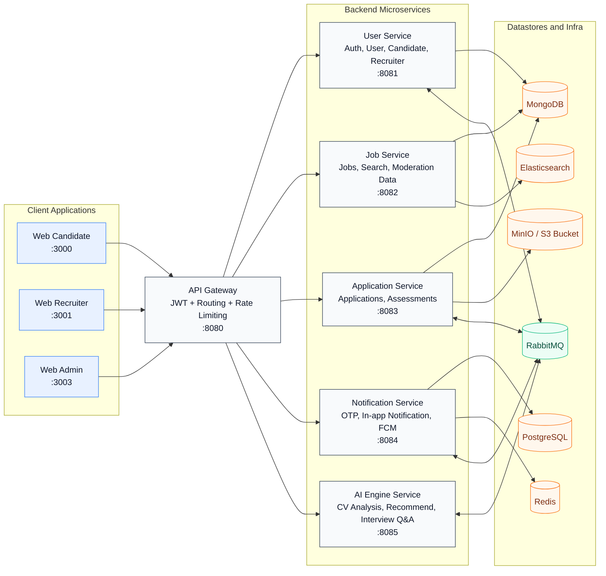
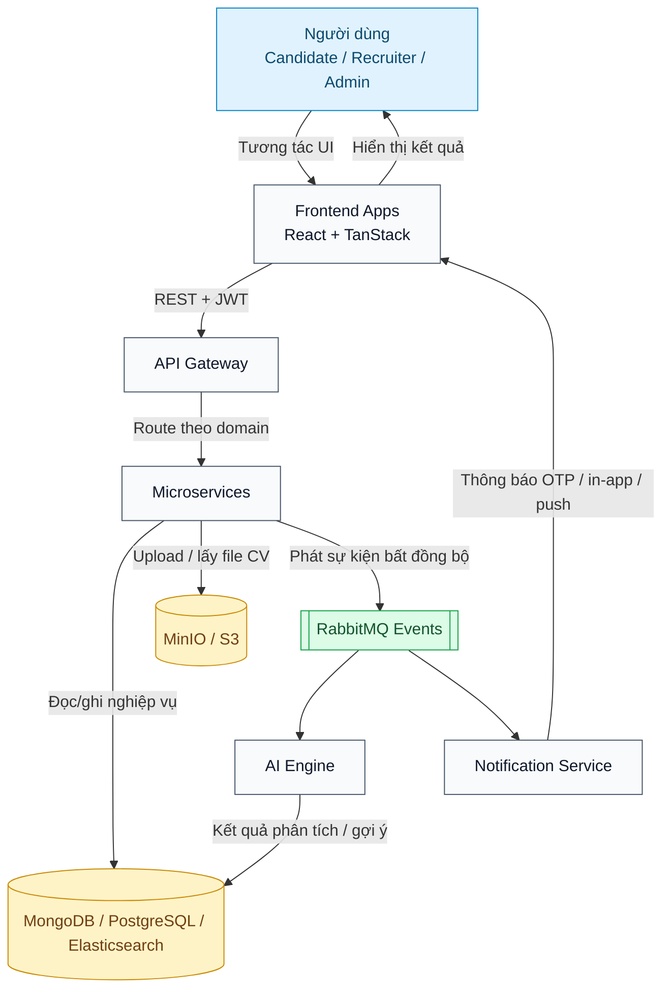
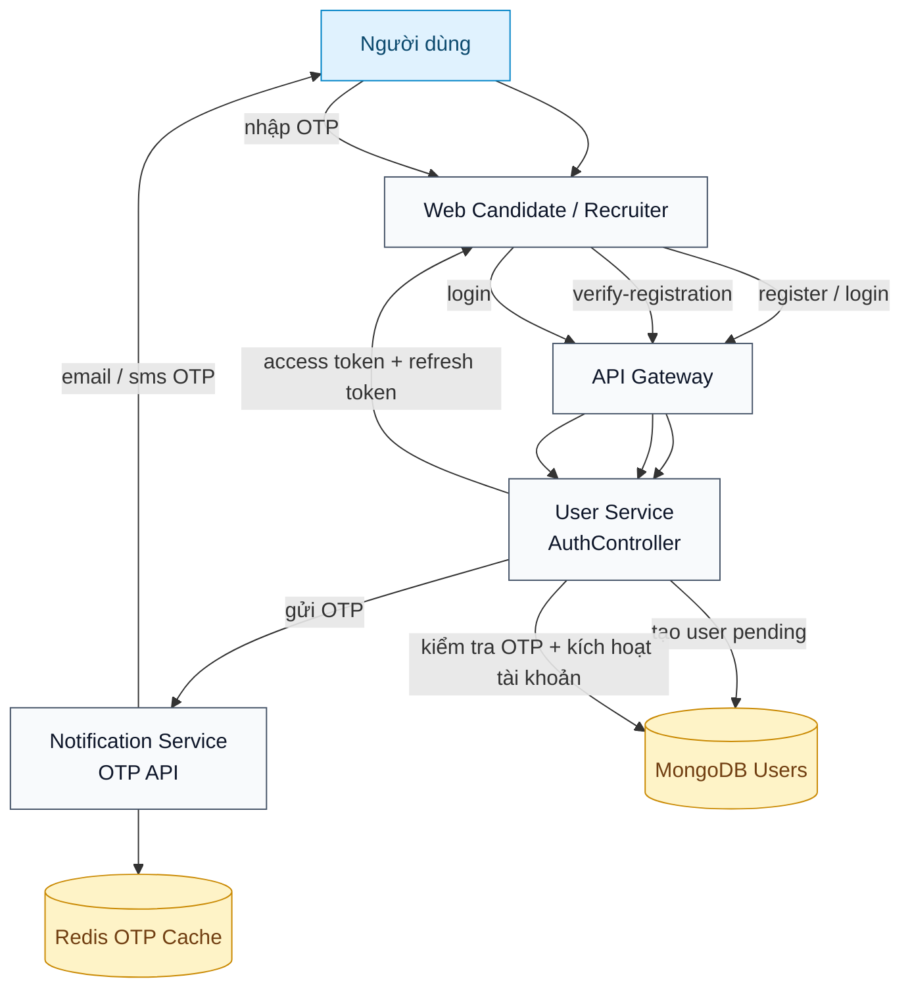
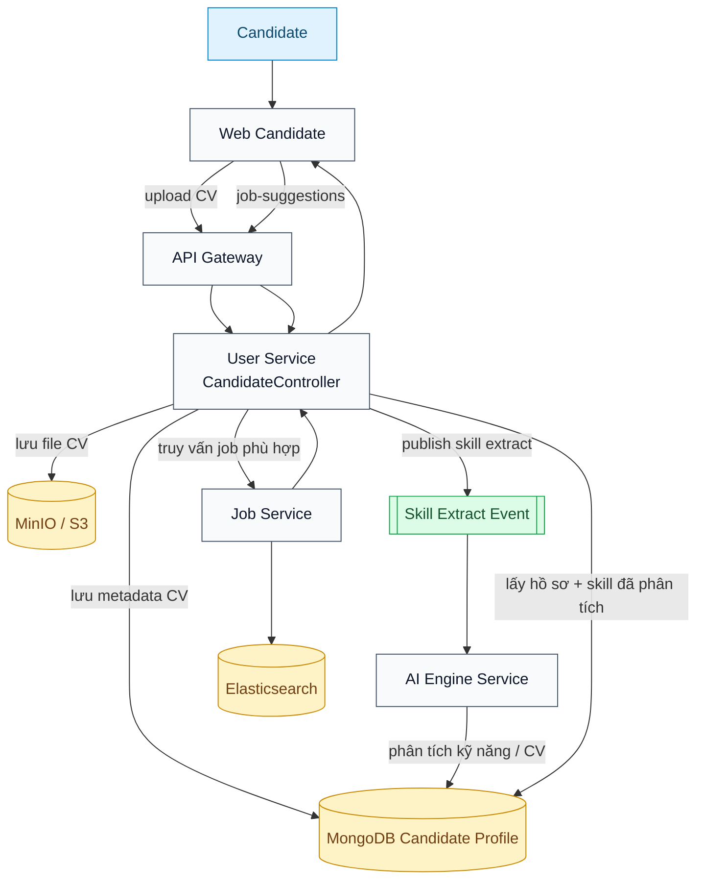
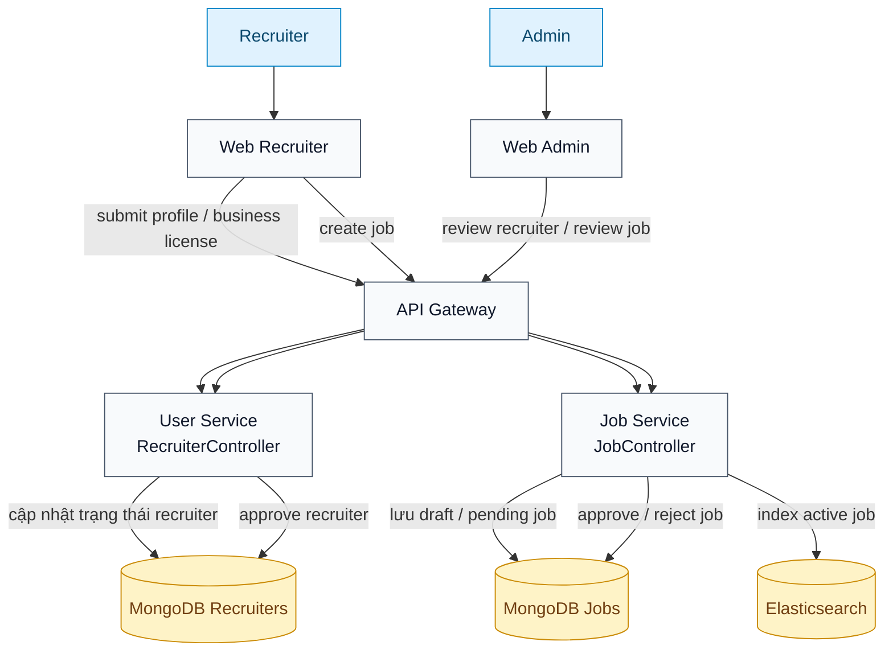
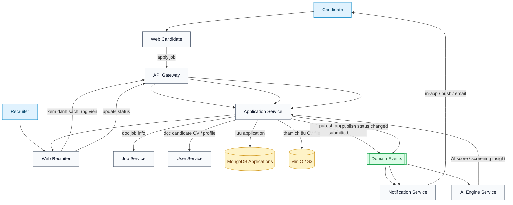
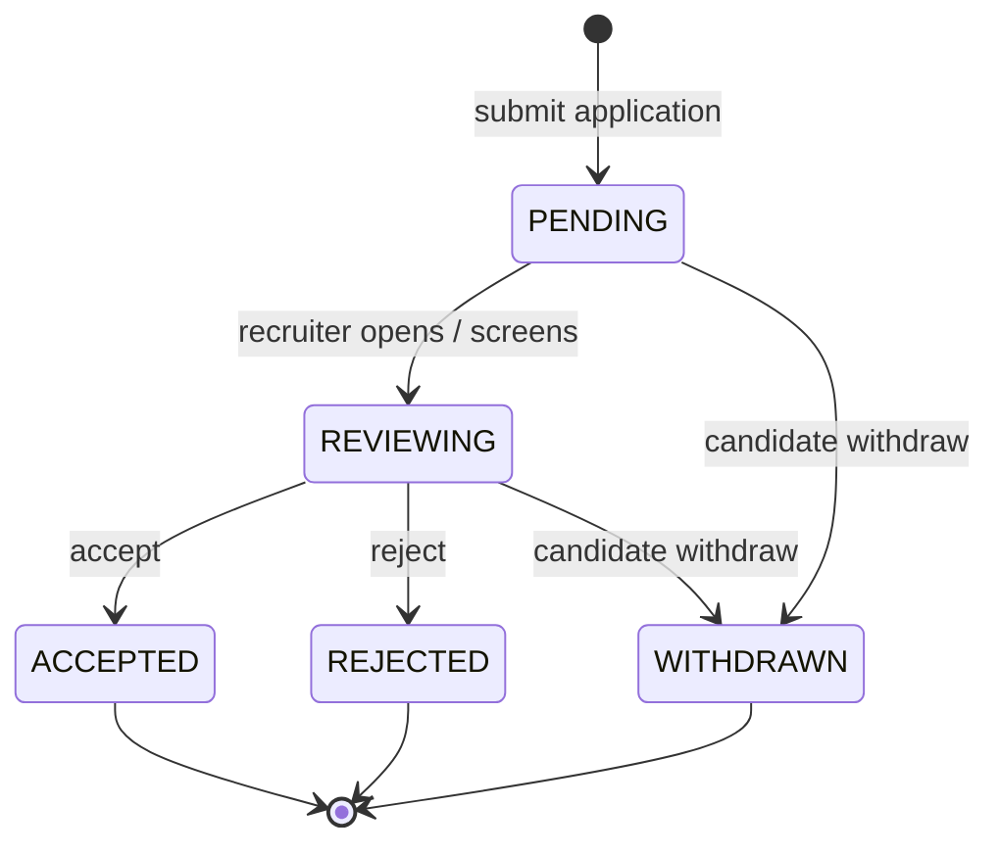
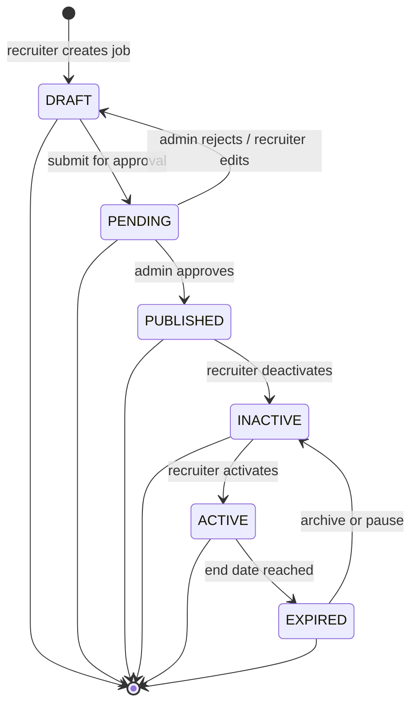
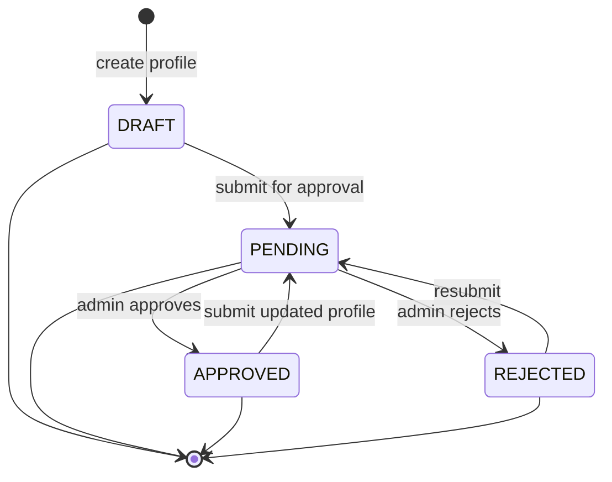

# SmartCV System Diagrams

Tài liệu này gom các sơ đồ Mermaid cho kiến trúc tổng thể, luồng dữ liệu và các chức năng chính của SmartCV.

## 1. Kiến trúc hệ thống tổng thể

## 2. Sơ đồ luồng dữ liệu tổng quát

## 3. Chức năng chính

### 3.1 Đăng ký, xác thực OTP, đăng nhập

### 3.2 Upload CV, phân tích AI, gợi ý việc làm

### 3.3 Nhà tuyển dụng đăng tin và admin duyệt tin

### 3.4 Candidate ứng tuyển, recruiter sàng lọc, hệ thống gửi thông báo

## 4. Gợi ý sử dụng

- Dùng sơ đồ `1` khi mô tả kiến trúc tổng thể.
- Dùng sơ đồ `2` khi thuyết minh đường đi dữ liệu và tích hợp async.
- Dùng nhóm sơ đồ `3.x` khi trình bày use case chính với stakeholder cụ thể.
- Nếu cần render ít bị chồng chéo hơn nữa trong wiki, giữ từng sơ đồ ở một block Mermaid riêng như hiện tại, không gộp lại.

## 5. Biểu đồ trạng thái

### 5.1 Trạng thái application

### 5.2 Trạng thái job

### 5.3 Trạng thái recruiter profile

