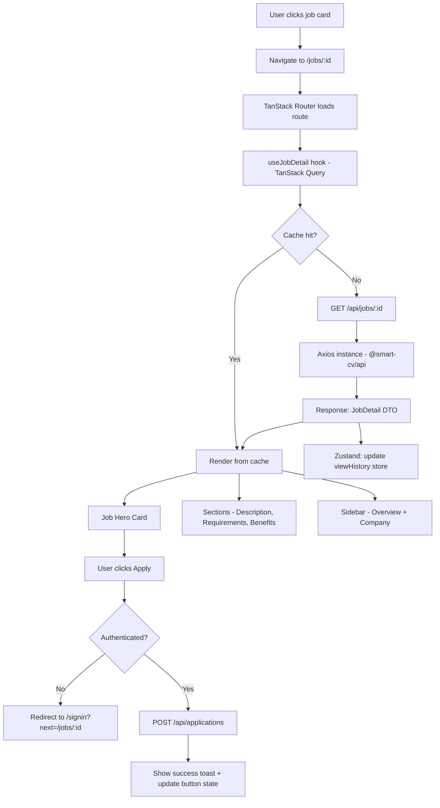

# Job Detail Page — UI/UX Design Specification
*Inspired by TopCV.vn Job Detail Page Patterns*

This document describes the layout, component structure, and design tokens for the **Job Detail** page of the SmartCV Candidate Portal (`apps/web-candidate`). All color values reference the SmartCV design system defined in `packages/ui/src/globals.css`.

---

## 1. Design Tokens (SmartCV Theme)

### Color Palette

| Token | CSS Variable | Approx. Hex | Purpose |
|:------|:-------------|:------------|:--------|
| **Background** | `--color-background` | `#FFFFFF` | Page background, main surface |
| **Foreground** | `--color-foreground` | `#060C1A` | Primary text — headings, body |
| **Primary** | `--color-primary` | `#7C3AED` | CTAs, active tags, focus rings, accent icons |
| **Primary Foreground** | `--color-primary-foreground` | `#F7F9FC` | Text on primary backgrounds |
| **Secondary** | `--color-secondary` | `#EEF3FA` | Chip backgrounds, tag pills, subtle fills |
| **Secondary Foreground** | `--color-secondary-foreground` | `#101830` | Text on secondary backgrounds |
| **Muted** | `--color-muted` | `#EEF3FA` | Section backgrounds, disabled states |
| **Muted Foreground** | `--color-muted-foreground` | `#677087` | Metadata labels, timestamps, helper text |
| **Card** | `--color-card` | `#FFFFFF` | Card surfaces |
| **Card Foreground** | `--color-card-foreground` | `#060C1A` | Card text |
| **Border** | `--color-border` | `#DDE5F0` | Dividers, card outlines, input borders |
| **Destructive** | `--color-destructive` | `#F24343` | Deadline warnings, error states |
| **Accent** | `--color-accent` | `#EEF3FA` | Hover states, highlight chips |

### Typography

| Role | Size | Weight | Variable |
|:-----|:-----|:-------|:---------|
| Job Title (H1) | `1.75rem` (28px) | `700` Bold | `text-foreground` |
| Section Heading (H2) | `1.125rem` (18px) | `600` Semi-bold | `text-foreground` |
| Company Name | `1rem` (16px) | `500` Medium | `text-primary` |
| Body / Description | `0.9375rem` (15px) | `400` Regular | `text-foreground` |
| Meta Labels | `0.875rem` (14px) | `400` Regular | `text-muted-foreground` |
| Badge / Tag | `0.75rem` (12px) | `500` Medium | context-dependent |

### Spacing & Radius

- **Border Radius**: `--radius` = `0.75rem` (12px) for cards; `0.375rem` (6px) for chips/badges
- **Card Padding**: `1.5rem` (24px)
- **Section Gap**: `1.5rem` (24px) vertical between sections
- **Grid Gap**: `1rem` (16px) between columns

---

## 2. Page Structure Overview

```
┌─────────────────────────────────────────────────────────────────────┐
│                          GLOBAL NAVBAR                              │
├─────────────────────────────────────────────────────────────────────┤
│  BREADCRUMB  Home > Tìm việc làm > [Job Title]                      │
├─────────────────────────────────────────────────────────────────────┤
│                                                                     │
│  ┌───────────────────────────────────────┐  ┌─────────────────────┐ │
│  │           JOB HERO CARD               │  │   JOB OVERVIEW      │ │
│  │  Logo | Title | Company | Meta Chips  │  │   SIDEBAR CARD      │ │
│  │  [Apply Now]  [Save Job]              │  │                     │ │
│  └───────────────────────────────────────┘  │   COMPANY INFO      │ │
│                                             │   SIDEBAR CARD      │ │
│  ┌───────────────────────────────────────┐  │                     │ │
│  │       JOB DESCRIPTION SECTION         │  │   REPORT JOB LINK   │ │
│  └───────────────────────────────────────┘  └─────────────────────┘ │
│                                                                     │
│  ┌───────────────────────────────────────┐                         │
│  │     CANDIDATE REQUIREMENTS SECTION    │                         │
│  └───────────────────────────────────────┘                         │
│                                                                     │
│  ┌───────────────────────────────────────┐                         │
│  │          BENEFITS SECTION             │                         │
│  └───────────────────────────────────────┘                         │
│                                                                     │
│  ┌───────────────────────────────────────┐                         │
│  │       WORKING LOCATION SECTION        │                         │
│  └───────────────────────────────────────┘                         │
│                                                                     │
│  ┌─────────────────────────────────────────────────────────────────┐│
│  │                  RELATED JOBS SECTION                           ││
│  └─────────────────────────────────────────────────────────────────┘│
└─────────────────────────────────────────────────────────────────────┘
│                          GLOBAL FOOTER                              │
└─────────────────────────────────────────────────────────────────────┘
```

**Grid**: `lg:grid-cols-[1fr_340px]` — main content left (fluid), sidebar right (fixed 340px).  
**Max width**: `max-w-6xl mx-auto px-4 md:px-6`.

---

## 3. Component Breakdown

### 3.1 Global Navbar

Same as the main portal navbar (`__root.tsx`). On this page, the sticky navbar adds a **mini action bar** when the user scrolls past the hero card:

```
┌──────────────────────────────────────────────────────────────┐
│  [Logo]  [Job Title — truncated]       [Lưu tin]  [Ứng tuyển]│
└──────────────────────────────────────────────────────────────┘
```

- Background: `bg-card border-b border-border shadow-sm`
- Sticky on scroll: `sticky top-0 z-50`

---

### 3.2 Breadcrumb

```
Home  >  Tìm việc làm  >  Kế Toán Kho Sản Xuất
```

- Font: `text-sm text-muted-foreground`
- Active item: `text-foreground font-medium`
- Separator `>`: `text-border`
- Container: `py-3 border-b border-border bg-muted/30`

---

### 3.3 Job Hero Card

**Component**: `<Card>` with `border-border bg-card shadow-sm`

```
┌─────────────────────────────────────────────────────────────┐
│  ┌──────┐  Kế Toán Kho Sản Xuất Dưới 1 Năm Kinh Nghiệm     │
│  │ LOGO │  ─────────────────────────────────────────────── │
│  │      │  🏢 Công ty TNHH ABC Manufacturing                │
│  └──────┘  📍 Đức Hòa, Long An    🕐 Đăng 2 ngày trước     │
│                                                             │
│  ┌──────────────┐ ┌────────────────┐ ┌───────────────────┐ │
│  │ 💰 8-10 tr   │ │ 📅 Còn 28 ngày │ │ 👤 < 1 năm KN    │ │
│  └──────────────┘ └────────────────┘ └───────────────────┘ │
│                                                             │
│  ┌─────────────────────────┐  ┌──────────────────────────┐ │
│  │  [★ Ứng tuyển ngay]     │  │  [♡ Lưu tin]             │ │
│  └─────────────────────────┘  └──────────────────────────┘ │
│                                                             │
│  ⚠ Hạn nộp hồ sơ: 30/06/2026                               │
└─────────────────────────────────────────────────────────────┘
```

**Sub-elements:**

| Element | Style |
|:--------|:------|
| Company Logo | `w-16 h-16 rounded-xl border border-border bg-muted object-contain p-1` |
| Job Title H1 | `text-2xl font-bold text-foreground` |
| Company Name | `text-base font-medium text-primary hover:underline` |
| Location Chip | `inline-flex items-center gap-1 text-sm text-muted-foreground` |
| Posted Date | `text-xs text-muted-foreground` |
| Salary Chip | `rounded-full bg-primary/10 px-3 py-1 text-sm font-medium text-primary` |
| Deadline Chip | `rounded-full bg-destructive/10 px-3 py-1 text-sm font-medium text-destructive` |
| Experience Chip | `rounded-full bg-secondary px-3 py-1 text-sm text-secondary-foreground` |
| Apply Button | `<Button>` — `bg-primary text-primary-foreground h-11 px-8 rounded-xl` |
| Save Button | `<Button variant="outline">` — `border-primary text-primary h-11 px-6 rounded-xl` |
| Deadline Warning | `text-sm text-destructive flex items-center gap-1` with `⚠` icon |

---

### 3.4 Job Description Section

**Container**: `<Card className="border-border bg-card p-6 space-y-4">`

```
┌─────────────────────────────────────────────────────────────┐
│  ▌ Mô tả công việc                                          │
│  ─────────────────────────────────────────────────────────  │
│  • Quản lý kho nguyên vật liệu, thành phẩm                  │
│  • Kiểm kê định kỳ, lập báo cáo tồn kho                     │
│  • Phối hợp với bộ phận sản xuất, kế toán tổng hợp          │
│  • Sử dụng phần mềm kế toán (MISA, FAST, v.v.)             │
│  • Theo dõi công nợ nhà cung cấp liên quan đến kho          │
└─────────────────────────────────────────────────────────────┘
```

- Section title: `text-lg font-semibold text-foreground border-l-4 border-primary pl-3`
- Divider: `<hr className="border-border">`
- Body text: `text-[15px] text-foreground leading-7`
- Lists: `list-disc pl-5 space-y-1.5 text-[15px] text-foreground`

---

### 3.5 Candidate Requirements Section

Same card style as 3.4.

```
┌─────────────────────────────────────────────────────────────┐
│  ▌ Yêu cầu ứng viên                                         │
│  ─────────────────────────────────────────────────────────  │
│  • Tốt nghiệp Cao đẳng / Đại học chuyên ngành Kế toán       │
│  • Kinh nghiệm dưới 1 năm (chấp nhận mới ra trường)         │
│  • Nữ, ưu tiên cư trú tại Long An                           │
│  • Thành thạo Excel, biết sử dụng phần mềm kế toán          │
│  • Cẩn thận, trung thực, chịu khó học hỏi                   │
│                                                             │
│  Kỹ năng yêu cầu:                                           │
│  [Excel] [MISA] [Kỹ năng giao tiếp] [Quản lý kho]          │
└─────────────────────────────────────────────────────────────┘
```

- Skill badges: `<Badge variant="secondary">` — `bg-secondary text-secondary-foreground rounded-full px-3 py-1 text-xs`

---

### 3.6 Benefits Section

```
┌─────────────────────────────────────────────────────────────┐
│  ▌ Quyền lợi                                                │
│  ─────────────────────────────────────────────────────────  │
│  ┌──────────────────┐  ┌──────────────────┐                 │
│  │ ✅ BHXH đầy đủ   │  │ ✅ Thưởng lễ Tết │                 │
│  └──────────────────┘  └──────────────────┘                 │
│  ┌──────────────────┐  ┌──────────────────┐                 │
│  │ ✅ Đào tạo nghề  │  │ ✅ Cơm trưa CT   │                 │
│  └──────────────────┘  └──────────────────┘                 │
└─────────────────────────────────────────────────────────────┘
```

- Benefit chips: `grid grid-cols-2 gap-2`
- Each chip: `flex items-center gap-2 rounded-lg border border-border bg-muted/50 px-3 py-2 text-sm text-foreground`
- Check icon: `text-primary h-4 w-4`

---

### 3.7 Working Location Section

```
┌─────────────────────────────────────────────────────────────┐
│  ▌ Địa điểm làm việc                                        │
│  ─────────────────────────────────────────────────────────  │
│  📍 Đức Hòa, tỉnh Long An                                   │
│                                                             │
│  ┌─────────────────────────────────────────────────────┐   │
│  │              [Map Placeholder / Embed]               │   │
│  │              bg-muted rounded-xl h-48               │   │
│  └─────────────────────────────────────────────────────┘   │
└─────────────────────────────────────────────────────────────┘
```

- Address: `text-sm text-foreground flex items-center gap-2`
- Map placeholder: `rounded-xl bg-muted h-48 flex items-center justify-center text-muted-foreground`

---

### 3.8 Sidebar — Job Overview Card

**Component**: `<Card className="border-border bg-card p-5 space-y-4 sticky top-20">`

```
┌──────────────────────────────────────┐
│  Thông tin chung                     │
│  ────────────────────────────────── │
│  📅 Hạn nộp HS     30/06/2026        │
│  💰 Mức lương      8 - 10 triệu      │
│  📊 Kinh nghiệm    Dưới 1 năm        │
│  🏷  Cấp bậc       Nhân viên         │
│  👥 Số lượng       2 người           │
│  📋 Hình thức      Toàn thời gian    │
│  ⏳ Thử việc       2 tháng           │
│  🕐 Thời gian      Hành chính        │
│  ♀  Giới tính      Nữ                │
└──────────────────────────────────────┘
```

Each row:
```
<div className="flex items-start justify-between text-sm py-2 border-b border-border last:border-0">
  <span className="flex items-center gap-2 text-muted-foreground">
    <Icon className="h-4 w-4 text-primary" /> Label
  </span>
  <span className="font-medium text-foreground text-right max-w-[55%]">Value</span>
</div>
```

---

### 3.9 Sidebar — Company Info Card

```
┌──────────────────────────────────────┐
│  ┌────┐  Công ty TNHH ABC            │
│  │LOGO│  Manufacturing               │
│  └────┘                              │
│  ────────────────────────────────── │
│  🏭 Ngành nghề    Sản xuất / Kho vận │
│  👥 Quy mô        100 - 500 nhân viên│
│  🌍 Quốc gia      Việt Nam           │
│                                      │
│  [Xem trang công ty →]               │
└──────────────────────────────────────┘
```

- Logo: `w-12 h-12 rounded-lg border border-border bg-muted object-contain p-1`
- Company name: `font-semibold text-foreground`
- Company subtitle: `text-sm text-muted-foreground`
- View profile link: `<Button variant="outline" className="w-full mt-2">` — `border-primary text-primary`

---

### 3.10 Related Jobs Section

Full-width section below the two-column layout.

```
┌────────────────────────────────────────────────────────────────┐
│  Việc làm liên quan                                            │
│  ──────────────────────────────────────────────────────────── │
│  ┌──────────────┐ ┌──────────────┐ ┌──────────────┐           │
│  │ [Job Card]   │ │ [Job Card]   │ │ [Job Card]   │           │
│  │ Title        │ │ Title        │ │ Title        │           │
│  │ Company      │ │ Company      │ │ Company      │           │
│  │ 💰 Salary    │ │ 💰 Salary    │ │ 💰 Salary    │           │
│  │ 📍 Location  │ │ 📍 Location  │ │ 📍 Location  │           │
│  └──────────────┘ └──────────────┘ └──────────────┘           │
└────────────────────────────────────────────────────────────────┘
```

- Grid: `grid gap-4 md:grid-cols-2 lg:grid-cols-3`
- Each card reuses the job card pattern from `routes/index.tsx`
- Card style: `<Card className="border-border bg-card hover:shadow-md transition-shadow">`

---

## 4. Interaction States

### Apply Button States

| State | Style |
|:------|:------|
| Default | `bg-primary text-primary-foreground` |
| Hover | `bg-primary/90` |
| Loading | Spinner inside button, `opacity-80 cursor-not-allowed` |
| Applied | `bg-muted text-muted-foreground border border-border` with checkmark icon |

### Save Job Toggle

| State | Style |
|:------|:------|
| Unsaved | `border-border text-foreground` with outline heart icon |
| Saved | `border-primary text-primary bg-primary/5` with filled heart icon |

### Sticky Navbar Scroll Trigger

- Appears when `scrollY > heroCard.offsetBottom`
- Transition: `transition-transform duration-200`
- Shows: truncated job title + quick apply button

---

## 5. Responsive Behavior

| Breakpoint | Layout |
|:-----------|:-------|
| Mobile `< md` (< 768px) | Single column. Sidebar stacks below main content. Apply button: full-width sticky bar at bottom. |
| Tablet `md` (768px–1023px) | Single column but sidebar becomes a collapsible drawer triggered by a floating "Ứng tuyển" FAB. |
| Desktop `lg+` (≥ 1024px) | Two-column `lg:grid-cols-[1fr_340px]`. Sidebar `sticky top-20`. |

**Mobile sticky apply bar:**
```
┌─────────────────────────────────────────────────────┐
│  8 - 10 triệu · Còn 28 ngày    [Ứng tuyển ngay →]  │
└─────────────────────────────────────────────────────┘
```
- `fixed bottom-0 left-0 right-0 z-50 bg-card border-t border-border p-3 flex items-center justify-between`

---

## 6. Route Setup (TanStack Router)

**File**: `apps/web-candidate/src/routes/jobs/$jobId.tsx`

```tsx
// Route: /jobs/$jobId
export const Route = createFileRoute('/jobs/$jobId')({
  component: JobDetailPage,
})
```

The `$jobId` param maps to the job listing ID. Data is fetched via TanStack Query using the auto-generated hook from `@smart-cv/api`.

---

## 7. Mermaid — Data Flow



---

## 8. Component Reuse Checklist

| Component | Source |
|:----------|:-------|
| `<Card>`, `<CardContent>` | `@smart-cv/ui` |
| `<Button>` | `@smart-cv/ui` |
| `<Badge>` | `@smart-cv/ui` |
| Icons | `lucide-react` |
| `cn()` utility | `@smart-cv/ui` |
| `useTranslation()` | `@smart-cv/i18n` |
| API hooks | `@smart-cv/api` (auto-generated) |
| Zustand store | `apps/web-candidate/src/store/` |
