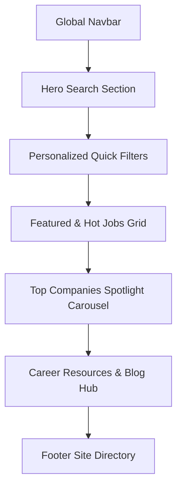

# Candidate Portal UI/UX & Layout Design Specification
*Inspired by ITViec.com UI/UX Patterns*

This document provides a comprehensive layout analysis and a detailed component-based tag structure specification for a state-of-the-art **Candidate Web Application** inspired by ITViec. The design balances a search-first user intent with visually rich aesthetics, dynamic animations, and modular structural components.

---

## 1. Global Design Tokens & Aesthetic System

To deliver a premium, high-impact user experience, the candidate web application adheres to a cohesive modern design system.

### Color Palette

| Token | CSS Variable | Hex Code | Purpose / Usage |
| :--- | :--- | :--- | :--- |
| **Primary Accent** | `--color-primary` | `#4B5694` | Signature brand blue for high-priority CTAs, focus indicators, and key tags. |
| **Secondary Accent**| `--color-accent` | `#EAE0CF` | Soft warm gold for review stars, hot job badges, and warnings. |
| **Dark Neutral (BG)**| `--color-bg-dark` | `#111844` | Base background color for modern orientation. |
| **Surface Neutral** | `--color-surface` | `#1F2833` | Component cards, modals, and input containers. |
| **Text Primary** | `--color-text-main` | `#FFFFFF` | Core readability text, titles, and headers. |
| **Text Secondary**| `--color-text-sub` | `#C5C6C7` | Job descriptions, metadata, dates, and placeholders. |
| **Border / Divider**| `--color-border` | `#333F48` | Subtle separators and outlines for card and input states. |

### Typography
*   **Primary Font Family:** `'Inter', 'Outfit', sans-serif` (imported from Google Fonts).
*   **Heading Scale:** H1 (`2.5rem`, bold) | H2 (`1.85rem`, semi-bold) | H3 (`1.4rem`, medium).
*   **Body Text:** `1rem` (regular) | **Micro-copy / Badges:** `0.85rem` (medium).

---

## 2. High-Level Page Layout

The portal is designed as a single-page layout hierarchy that maximizes the "above-the-fold" real estate to capture user search intent immediately, followed by structured, discovery-based sections.



---

## 3. Structural Component Tags & Details

Below is the structured HTML and styling layout breakdown for each key component.

### 3.1. Navigation Header Component (`<header>`)
A sticky navigation bar providing instant utility and account access.

```html
<header class="global-navbar">
  <div class="navbar-container">
    <!-- Brand Logo -->
    <a href="/" class="brand-logo" aria-label="SmartCV Home">
      
      <span class="logo-text">Smart<span>CV</span></span>
    </a>

    <!-- Main Navigation Links -->
    <nav class="nav-menu" aria-label="Primary Navigation">
      <ul class="nav-list">
        <li class="nav-item"><a href="/jobs" class="nav-link active">All Jobs</a></li>
        <li class="nav-item"><a href="/companies" class="nav-link">IT Companies</a></li>
        <li class="nav-item"><a href="/blog" class="nav-link">Blog & Stories</a></li>
      </ul>
    </nav>

    <!-- Candidate Actions -->
    <div class="user-actions">
      <a href="/employer-portal" class="btn-employer-link">For Employers</a>
      <a href="/login" class="btn-login">Sign In</a>
      <a href="/register" class="btn-cta btn-register">Join Now</a>
    </div>

    <!-- Mobile Burger Menu -->
    <button class="mobile-toggle" aria-expanded="false" aria-controls="mobile-nav">
      <span class="burger-bar"></span>
    </button>
  </div>
</header>
```

### 3.2. Hero Search Interface (`<section class="hero-search">`)
The high-converting center stage of the homepage. Designed with visual glassmorphism over subtle grid patterns.

```html
<section class="hero-search" aria-label="Job Search Engine">
  <div class="hero-content">
    <h1 class="hero-title">1,000+ Developer Jobs. <span class="gradient-text">Zero Spam.</span></h1>
    <p class="hero-subtitle">Find jobs that value your skills. Filter by stack, benefits, and salary transparency.</p>
    
    <!-- Unified Search Panel -->
    <form class="search-form-wrapper" role="search" action="/jobs" method="GET">
      <div class="search-input-group">
        <i class="icon-search" aria-hidden="true"></i>
        <input type="search" name="keyword" class="search-input" placeholder="Keyword, Skill, Company..." required />
      </div>
      
      <div class="search-select-group">
        <i class="icon-geo" aria-hidden="true"></i>
        <select name="location" class="search-select" aria-label="Select City">
          <option value="all">All Locations</option>
          <option value="hcm">Ho Chi Minh City</option>
          <option value="hn">Ha Noi</option>
          <option value="dn">Da Nang</option>
          <option value="remote">Remote</option>
        </select>
      </div>

      <button type="submit" class="btn-search-submit">
        <span>Search Jobs</span>
      </button>
    </form>

    <!-- Quick Tags / Hot Tech -->
    <div class="trending-tags">
      <span class="tags-label">Hot Tech:</span>
      <a href="/jobs?keyword=React" class="trend-badge">React</a>
      <a href="/jobs?keyword=Node.js" class="trend-badge">Node.js</a>
      <a href="/jobs?keyword=Python" class="trend-badge">Python</a>
      <a href="/jobs?keyword=Docker" class="trend-badge">Docker</a>
    </div>
  </div>
</section>
```

### 3.3. Job Card Grid Component (`<article class="job-card">`)
The foundational card displaying essential job listing metrics to enable fast decision making.

```html
<article class="job-card" data-job-id="job-101">
  <!-- Top section: Logo & Basic Info -->
  <div class="job-card-header">
    <div class="company-logo-wrapper">
      
    </div>
    <div class="job-title-group">
      <h3 class="job-title"><a href="/jobs/senior-nodejs-developer">Senior Node.js Backend Developer</a></h3>
      <p class="company-name">NexusTech Solutions</p>
    </div>
    <button class="btn-bookmark" aria-label="Bookmark this job" aria-pressed="false">
      <svg class="icon-bookmark" viewBox="0 0 24 24"><path d="M17 3H7c-1.1 0-2 .9-2 2v16l7-3 7 3V5c0-1.1-.9-2-2-2z"/></svg>
    </button>
  </div>

  <!-- Middle section: Highlighting stats -->
  <div class="job-meta-metrics">
    <span class="meta-item salary-badge">
      <i class="icon-dollar"></i> $2,500 - $3,500
    </span>
    <span class="meta-item location-tag">
      <i class="icon-pin"></i> Ho Chi Minh City (Hybrid)
    </span>
  </div>

  <!-- Skill / Tech Stack tags -->
  <div class="job-skills-list">
    <span class="skill-pill">Node.js</span>
    <span class="skill-pill">TypeScript</span>
    <span class="skill-pill">AWS</span>
    <span class="skill-pill">PostgreSQL</span>
  </div>

  <!-- Footer section: Time and Quick Apply Button -->
  <div class="job-card-footer">
    <span class="post-time">Posted 2 hours ago</span>
    <button class="btn-secondary-apply" data-action="quick-apply">Quick Apply</button>
  </div>
</article>
```

### 3.4. Company Spotlight Showcase (`<div class="company-card">`)
Highlights top employers to appeal to passive job-seekers looking for structural company culture fits.

```html
<div class="company-card">
  <div class="company-banner" style="background-image: url('/assets/company-bg-1.jpg');"></div>
  
  <div class="company-card-details">
    <div class="company-avatar-wrapper">
      
    </div>
    
    <h3 class="company-title">InnovateHub Vietnam</h3>
    
    <div class="company-reviews">
      <span class="stars-rating">
        <i class="star-filled">★</i>
        <i class="star-filled">★</i>
        <i class="star-filled">★</i>
        <i class="star-filled">★</i>
        <i class="star-half">★</i>
      </span>
      <span class="reviews-count">(45 reviews)</span>
    </div>

    <p class="company-pitch">Leading software hub focused on AI integrations and scaling cloud platforms globally.</p>
    
    <div class="company-card-footer">
      <span class="hiring-tag">12 Open Positions</span>
      <a href="/companies/innovatehub" class="btn-text-arrow">View Profile</a>
    </div>
  </div>
</div>
```

---

## 4. UI/UX Interaction and Animation Specifications

To ensure the interface feels alive and highly premium, we specify micro-animations using pure CSS:

### 4.1. The Job Card Elevate Effect
Hovering over a `.job-card` triggers a subtle scaling and border glowing effect to denote focus:
```css
.job-card {
  transition: transform 0.3s cubic-bezier(0.25, 0.8, 0.25, 1), 
              box-shadow 0.3s cubic-bezier(0.25, 0.8, 0.25, 1),
              border-color 0.3s ease;
  border: 1px solid var(--color-border);
}

.job-card:hover {
  transform: translateY(-5px);
  border-color: var(--color-primary);
  box-shadow: 0 12px 24px rgba(230, 0, 42, 0.15);
}
```

### 4.2. Active Bookmark Micro-Animation
When clicking on the `.btn-bookmark` button:
```css
.btn-bookmark svg {
  transition: transform 0.2s ease, fill 0.2s ease;
  fill: transparent;
  stroke: var(--color-text-sub);
}

.btn-bookmark.active svg {
  transform: scale(1.2);
  fill: var(--color-primary);
  stroke: var(--color-primary);
}
```

### 4.3. Sticky Float Apply Option
When a candidate scrolls through a detailed job posting, a sticky floating banner appears at the bottom of the viewport with the apply button, ensuring seamless conversion accessibility.

---

## 5. SEO Best Practices
*   **Document Structure:** Every view guarantees exactly one structural `<h1>` in the `.hero-search` section.
*   **Semantic Elements:** Use `<article>` for separate job cards, `<section>` for layout regions, and `<nav>` for menus.
*   **Metadata Integration:** Includes custom metadata schemas (JSON-LD) dynamically representing specific `JobPosting` data, matching Google's job indexing structures.
